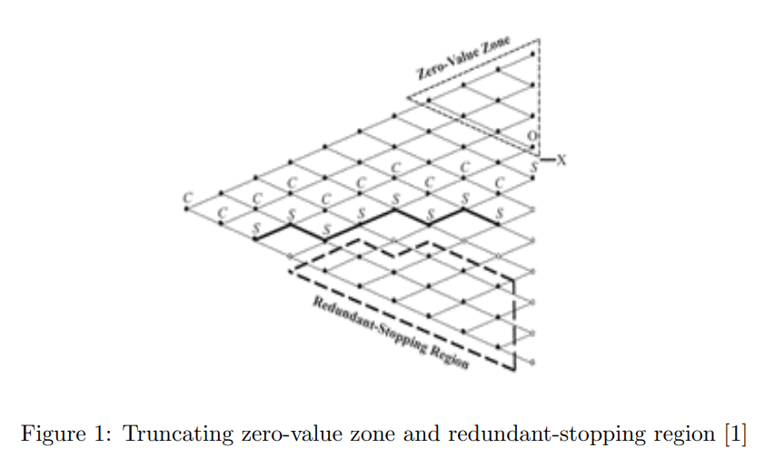

In order to improve the run-time efficiency and computational accuracy of the binomial method for
pricing American options, we implement the Intelligent Lattice Search method by Qianru Shang and
Brian Byrne (2019) on the BBSR model. The BBSR model guarantees us to have more accurate
result in less steps comparing with the original binomial model, and the Intelligent Lattice Search
method provides us a shortcut to calculate each nodes of the binomial tree, which greatly reduce
the computation cost of the original binomial model. In short, the runtime and space complexity
could be reduced from O(n2) to O(n). We decrease the runtime of a 8000-step binomial tree from
2.97 seconds (traditional binomial tree model) to 0.13 seconds.
